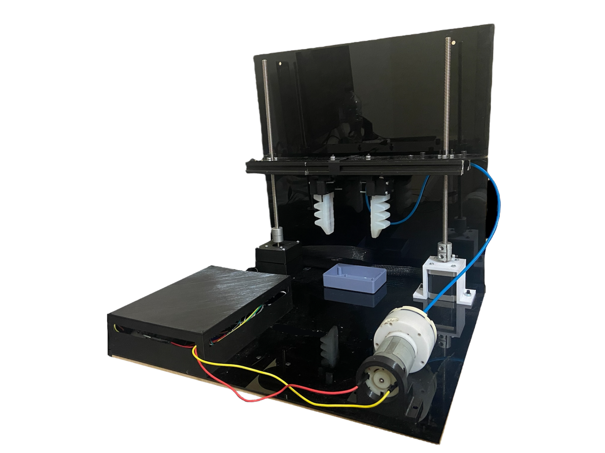
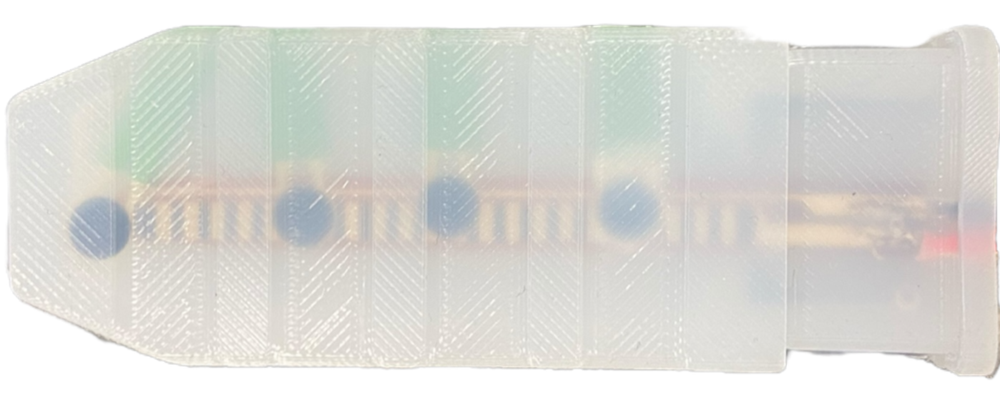
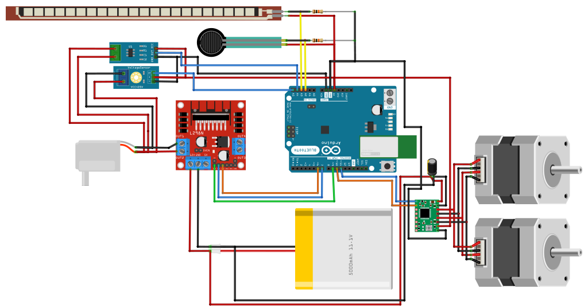

# AI-Controlled Soft Gripper for Stiffness-Based Adaptive Grasping

This project was developed as part of my bachelor's graduation thesis in robotics engineering. It features a soft pneumatic gripper system that uses an AI-based controller to adjust its grasp based on object stiffness, sensed through embedded tactile sensors. The system is designed to operate without predefined configurations or manual adjustments, enabling flexible handling of unknown objects.

## System Architecture

This section outlines the hardware design and integration of the AI-based soft gripper system, including the experimental setup, actuator design, and electronic control layout.

### Experimental Setup

The experimental platform includes a soft gripper mounted on a linear positioning system with a lead screw mechanism driven by stepper motors. The base and Z-axis stage are reinforced using aluminum extrusions and laser-cut acrylic to ensure mechanical stability and minimize sensor interference during testing.

> *Designed for repeatable, stable trials during data collection and model validation.*

  

### Soft Pneumatic Actuator with Integrated Sensors

The soft gripper uses DragonSkin 20-based PneuNet bending actuators with embedded bending and force sensors. These actuators are cast using 3D-printed molds with pre-positioned sensors, ensuring proper alignment and consistent performance across trials.

  

  

### Wiring Configuration and Component Layout

The system is powered and controlled via a modular electronics setup, consisting of:
- **12V Air Pump** for pneumatic actuation  
- **L298N Motor Driver** for pump control  
- **TMC2208 Drivers** for stepper motor movement  
- **Voltage & Current Sensors** for monitoring actuation load  
- **Arduino UNO Microcontroller** handling PWM generation and sensor data acquisition

  

---

